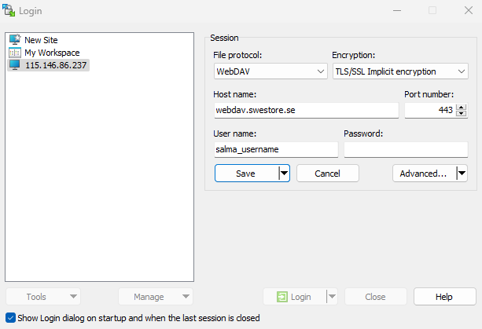
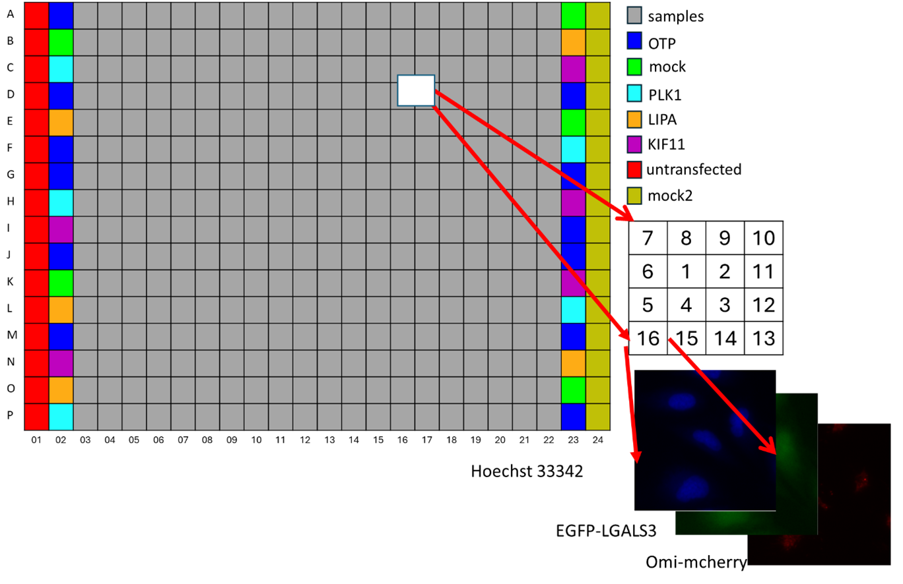

# Preprocessing

The original images were in .C01 microcopic format stored on [Swestore](https://docs.swestore.se/).


## Access to Swestore

For accessing Swestore, we have used two different tools.

### Lftp

First, we have used lftp through terminal: 
```bash
lftp https://username@webdav.swestore.se/snic/folder/
```

For downloading whole plate we used:
```bash
get plate_number.tar.gz
```

For uploading files we have used:
```bash
put plate_number.tar.gz
```

### WinSCP

The other way to access files on Swestore was winscp tool which is a win-based tool.




## Format conversion

For extracting and converting the format of images we have used "bfconvert" function of [bftools](https://docs.openmicroscopy.org/bio-formats/5.7.1/users/comlinetools/index.html) command line tool. 

This is conducted through command line or  preprocessing/extract_conversion.py script and subprocess library.

## Normalize script

The following command should run over images after bfconvert command to normalize images to 8-bit format,

´´´bash
ls *.png ; while read file; do convert file -auto-level  -depth 8 -define quantum:format=unsigned -type grayscale file; done
´´´´

or through extract_conversion.py script.


## Check number of images

For a correct, complete plate we should have A-P rows as well as 01-24 columns (6144).



with the following command we could see if each well (A01-P24) and 16 images per well exist.


´´´bash
ls | cut -d _ -f 3 | cut -b 1-3 | sort |  uniq -c 
´´´

