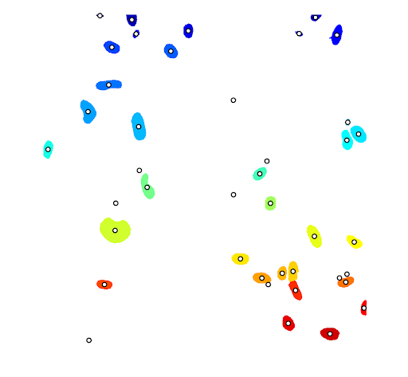

# HoVer-Net training


The code of HoVer-Net taken from 

```bash
git clone https://github.com/vqdang/hover_net.git
```

The data required to be in .mat format as having centeroind points of objects. This has been done through find_middle_point.m script written in MATLaB.

An example of annotated masks with centric points:




The training, prediction and evaluation scripts for HoverNet are as follows:


```plaintext
HoverNet/
├── src
│   ├── find_middle_point.m
│   ├── extract_patches.py
│   ├── run_train.py
│   ├── run_train.sh
│   ├── run_infer.py
│   ├── epoch_run.sh
│   ├── run_infer.sh
│   ├── HoverNet_evaluation_nuclei.ipynb
│   ├── HoverNet_evaluation_test_data.ipynb
│   ├── run_infer.sh
├── dataset
│   ├──Train
│       ├── Images
│       │       ├──*.png
│       └── Labels
│       │       ├──*.mat
│   ├──Test
│       ├── Images
│       │       ├──*.png
│       └── Labels
│       │       ├──*.mat
├── output
```

We have used hovernet pytorch version by env provided [here](https://github.com/vqdang/hover_net.git). 
and also updating as follows:

```bash
pip install torch==1.7.1+cu110 torchvision==0.8.2+cu110 torchaudio===0.7.2 -f https://download.pytorch.org/whl/torch_stable.html

```

extract_patches.py has been used for extracting smaller patches from train set saved as .npy numpy array.

For fine-tuning HoverNet model hovernet_original_consep_notype_tf2pytorch.tar pretrained model were used from pre_models directory.

We trained hovernet with 130 images (100 from BBBC and 30 from Aits training images) and validated and tested on test and validation set from [here.](https://www.sciencedirect.com/science/article/pii/S2352340922009726)
 
```bash
#!/usr/bin/env bash
#SBATCH --gpus 4
#SBATCH -A project_name
#SBATCH -t 3:00:00
#SBATCH -n 5
#python run_train.py --gpu='0,1,2,3' > nuclei_results.txt
```


For validating models, we have run run_infer.py function for all models in every epoch.
```bash
#!/usr/bin/env bash
#SBATCH -n 3 --gpus=2
##SBATCH --gpus 10
#SBATCH -A project_name
#SBATCH -t 30:00:00

for VARIABLE in `seq 1 50`
do
python run_infer.py --model_path="logs/00/net_epoch=${VARIABLE}.tar" --model_mode='original' tile --input_dir='../dataset/Test/Images' --output_dir="output/${VARIABLE}"

done
```


We have plotted the training MSE loss of HoverNet for segmentation part as follows:


