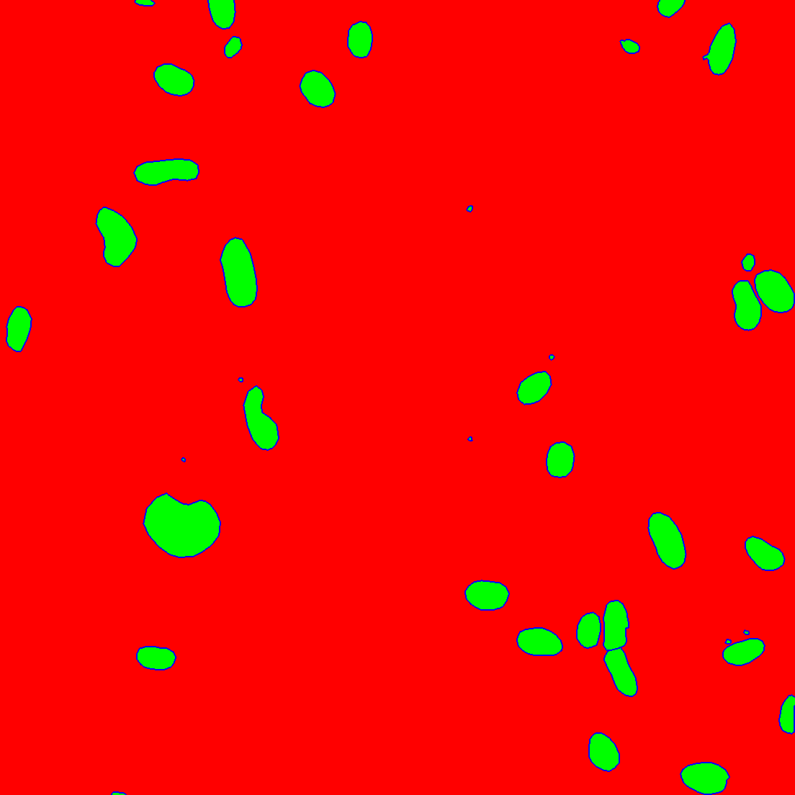

# U-Net training

For training U-Net models, the code is taken and modified from [carpenterLab](https://github.com/carpenterlab/unet4nuclei/tree/master/unet4nuclei).


## Annotation

For training UNet models, some images are taken from [Broadinstitute](https://bbbc.broadinstitute.org/) as well as annotated masks for similarity of these images to
Our own images. However, we had to annotate more of our own images and combine them with online available images.
For this purpose, we have used cvat tool.

#### cvat

How we used:
```bash
 git clone https://github.com/opencv/cvat
 cd cvat
```


Run docker containers. It will take some time to download the latest CVAT release and other required images like postgres, redis, etc. from DockerHub and create containers.
```bash
 docker compose up -d
```
(Optional) Use CVAT_VERSION environment variable to specify the version of CVAT you want to install specific version (e.g v2.1.0, dev). Default behavior: dev images will be pulled for develop branch, and corresponding release images for release versions.
```bash
CVAT_VERSION=dev docker compose up -d
```

Alternative: if you want to build the images locally with unreleased changes see How to pull/build/update CVAT images section
You can register a user but by default, it will not have rights even to view the list of tasks. Thus you should create a superuser. A superuser can use an admin panel to assign correct groups to other users. Please use the command below:

```bash
sudo docker exec -it cvat_server bash -ic 'python3 ~/manage.py createsuperuser'
```

If you don’t have winpty installed or the above command does not work, you may also try the following:


```bash
# enter docker image first
docker exec -it cvat_server /bin/bash
# then run
python3 ~/manage.py createsuperuser
```
Choose a username and a password for your admin account.
Open the installed Google Chrome browser and go to localhost:8080. 
Type your login/password for the superuser on the login page and press the Login button. Now you should be able to create a new annotation task. 

I also had to download docker desktop. Now I only open that and run cvat container on that. 
Then open localhost:8080 on my browser. In cvat also I can define projects and labels.
Then add a job and start to annotate. Annotations are polygons and not polyline. 


## Published Datasets

The annotated datasets are published.


[Nuclei](https://www.sciencedirect.com/science/article/pii/S2352340922009726)


[Cytosol](https://www.sciencedirect.com/science/article/pii/S2352340924011107)


## Preprcoessing

After exporting annotation masks from cvat, train/UNet/preprocessing.py script will run over masks to create boundary images.

```bash
python3 preprocessing.py
```
example of raw annotated image


Three class (background, inside and boundary pcs) images are as follows:





## Training

After having directories in the following order:

```plaintext
UNet/
├── data
│   ├── 0_raw_images
│   ├── 1_raw_annotations
│   ├── 2_norm_images
│   ├── 2_norm_images_merged
│   ├── 3_boundary_labels
│   └── 4_filelists
│       ├── TEST.txt
│       ├── training.txt
│       └── VALIDATION
├── src
│   ├── utils
│   ├── preprocessing.py
│   ├── training.py
│   ├── prediction.py
│   ├── evaluation.ipynb
│   ├──experiments
│       ├── experiment_name
│       │   ├── models
│       │   │   ├── model_xxx.hdf5
│       │   ├── log.csv
│       │   ├── model.hdf5
│   └── experiment_name
│       ├── out
│       │   │   ├── prob
│       │   │   └── segm

```


we trained models with:

```bash
python3 training.py
```

## Prediction


we predicted the segmentation masks of validation and test images with the best model :

```bash
python3 prediction.py
```

